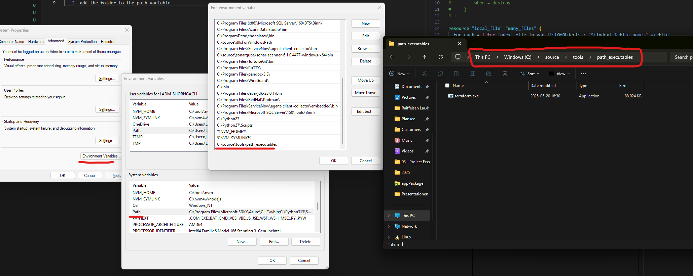

# About this folder

Here a minimal template is provided to get started with the exercises for the workshop part 2.

# Prerequisites

1. The `terraform` command can be executed
   1. download the terraform.exe file from the hashicorp website, move it to a folder of your choice (best to use a empty one)
   2. add the folder to the path variable 
2. Set the environment variable `GOOGLE_APPLICATION_CREDENTIALS` with the following command. Your personal key file is located in the folder `gcp\administrative\keys`. (More about this topic: https://cloud.google.com/docs/terraform/authentication)

Windows:

```shell
$env:GOOGLE_APPLICATION_CREDENTIALS="KEY_PATH"
```

Example:

```shell
$env:GOOGLE_APPLICATION_CREDENTIALS="C:\Users\username\Downloads\service-account-file.json"
```

Linux:

```shell
export GOOGLE_APPLICATION_CREDENTIALS="KEY_PATH"
```

Example:

```shell
export GOOGLE_APPLICATION_CREDENTIALS="/home/user/Downloads/service-account-file.json"
```

NOTE: The service accounts will be deleted after the workshop!

# Exercise:

1. Create resource `google_storage_bucket`
2. create variables
   1. project = "terraform-learning-460507"
   2. region = "us-east1"
   3. a uniqe bucket name (not only test, add some context so it can be identified)
3. create `.tfvars` file for the variables
4. create a bucket resource `google_storage_bucket_object` where a file is stored inside the bucket

Additional:

1. create 2 workspaces where each workspace creates different buckets (like DEV and PROD)
2. look through the documentation if you want to add something else with storage/buckets, feel free to test what ever you want
3. see the folder learn-terraform-local-files to also create a local file where some informations are stored, about the bucket (https://registry.terraform.io/providers/hashicorp/google/latest/docs)

GCP documenation resources for the exercise:

https://registry.terraform.io/providers/hashicorp/google/latest/docs/resources/storage_bucket
https://registry.terraform.io/providers/hashicorp/google/latest/docs/resources/storage_bucket_object
